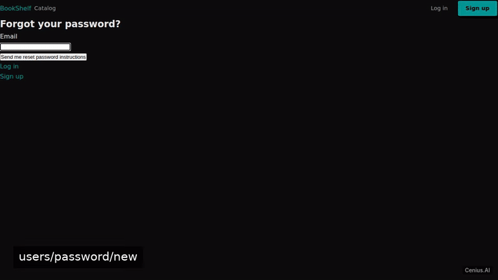
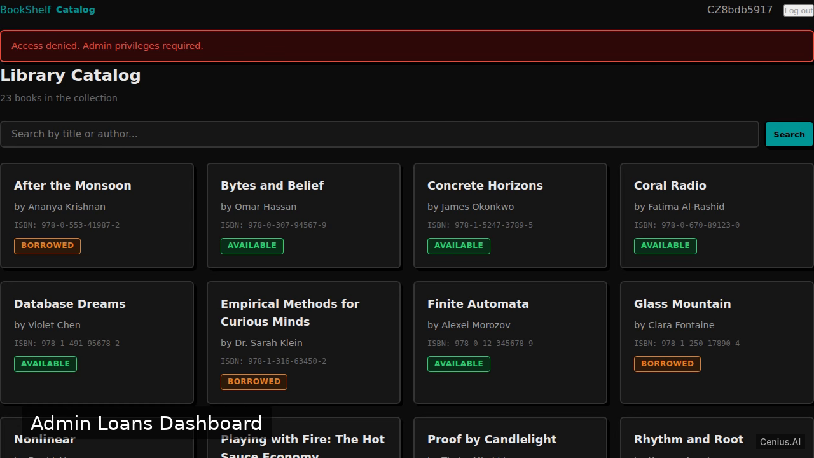
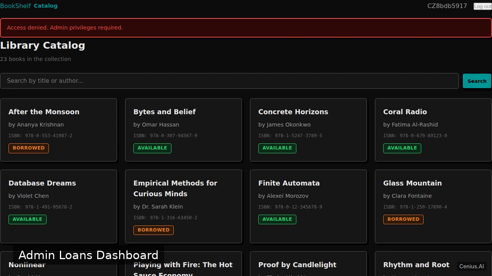

# BookShelf Manager — complete Ruby on Rails book admin panel example app

A Ruby on Rails book admin panel, open-source and ready to self-host: that's **BookShelf Manager**. A Ruby on Rails 7 web application for library management. BookShelf Manager ships complete — source, design assets, seed data — under the Apache-2.0 license; no cloud account needed. [Remix BookShelf Manager on cenius.ai](https://cenius.ai/marketplace/p/bookshelf-manager?ref=gh&utm_campaign=bookshelf-manager-rails) for a custom build.


[](LICENSE)  [](https://cenius.ai)

[](https://cenius.ai/marketplace/p/bookshelf-manager?ref=gh&utm_campaign=bookshelf-manager-rails)

> **▶ [Open & edit in cenius.ai](https://cenius.ai/marketplace/p/bookshelf-manager?ref=gh&utm_campaign=bookshelf-manager-rails)** — one click to an editable workspace: describe changes in plain English, get an instant preview, one-click deploy and host. Modifications made on the platform come with full rebrand & relicense rights.

_Local clone? See [Quick start](#quick-start) below. cenius.ai is the zero-setup path._

## Demo



▶ **[Watch the full demo video](https://cenius.ai/marketplace/p/bookshelf-manager?ref=gh&utm_campaign=bookshelf-manager-rails)** — the complete walkthrough, playing on the project's cenius.ai page · [MP4 file](.github/media/demo.mp4)

## Screenshots

  

## Architecture

`install.sh` wires up dependencies and loads seed records; after it runs the app has real data to show. The Ruby on Rails codebase (1,673 files) is self-contained — no external services needed to evaluate it. Top-level layout: `app/`, `bin/`, `config/`, `db/`, `lib/`, `log/`, `public/`, `storage/`. Step-by-step setup guide: [`INSTALL.md`](INSTALL.md).

## Features

- User Authentication
- Book Catalog Browsing
- Book Details & Borrow/Return
- Admin Book Management
- Admin Loan Overview
- Seed Data

## Quick start

```bash
./install.sh   # installs dependencies + seeds demo data
```

See [`INSTALL.md`](INSTALL.md) for full setup and usage instructions.

## Usage guide

### Using BookShelf Manager

After starting the server (`bin/rails server`), open a browser and navigate to `http://localhost:3000`.

#### Registration & Login

- **Sign up** at `/users/sign_up`
- **Log in** at `/users/sign_in`

Authentication is powered by [Devise](https://github.com/heartcombo/devise). Users are automatically created as regular members. Admin users must be set manually (e.g., via the Rails console).

#### Member Features

- **Browse catalog**: The root page (`/`) lists all books. Click any book to view its details.
- **Borrow a book**: On a book’s detail page (`/books/:id`), if the book is available, a “Borrow” button appears. Click it to check out the book. The UI updates instantly via Turbo Stream.
- **Return a book**: If you currently have the book borrowed, a “Return” button replaces the borrow action. Click it to check in the book.

#### Admin Features

Admins access management interfaces under `/admin`.

- **Add a new book**: Visit `/admin/books/new`, fill in the title, author, and other details, then submit. After creation, the book appears in the catalog.
- **View all loans**: The page `/admin/loans` lists every active loan, showing who has which book and when it was borrowed.

#### Example cURL Interactions

*These examples assume a running local server and a valid session cookie. Obtain the CSRF token from the page’s `<meta>` tag or cookie.*

**Borrow a book** (POST request):

_Full guide: [`USAGE.md`](USAGE.md)_

## FAQ

### How do I self-host BookShelf Manager?

Pull the repo, run `./install.sh`, and you are up — the script installs packages and pre-seeds the database. [`INSTALL.md`](INSTALL.md) covers any platform-specific tweaks.

### What if I want to add features to BookShelf Manager without coding?

The easiest route: [visit the project on cenius.ai](https://cenius.ai/marketplace/p/bookshelf-manager?ref=gh&utm_campaign=bookshelf-manager-rails), tell the platform what to change, and collect the updated build. No source-editing needed.

### Is it possible to white-label BookShelf Manager for a client?

Yes. You can edit the source directly under the MIT license, or [remix it on cenius.ai](https://cenius.ai/marketplace/p/bookshelf-manager?ref=gh&utm_campaign=bookshelf-manager-rails) — the platform route grants full rebrand and relicense rights over your derivative.

### What technologies are in BookShelf Manager's stack?

Ruby on Rails. The full source in this repository is exactly what the app runs. Highlights include seed Data.

### Can I build a business on BookShelf Manager?

It is. Apache-2.0 licensing means you can build a product on it, sell it, or use it inside a company with no fees. Details: [LICENSE](LICENSE).

## License & rebranding

Released under the [Apache License 2.0](LICENSE) (© 2026 Cenius AI) — free for personal and commercial use. The Cenius name/logo are trademarks (see NOTICE).

**Need a customized version?** [Remix this app on cenius.ai](https://cenius.ai/marketplace/p/bookshelf-manager?ref=gh&utm_campaign=bookshelf-manager-rails) — modifications made on the platform come with **full rebrand & relicense rights** over your derivative.

## Built with cenius.ai

This entire application — code, design, seeded demo data — was generated on **[cenius.ai](https://cenius.ai)** from a plain-English description.

- 🚀 [Build your own app on cenius.ai](https://cenius.ai)
- 🎛️ [Remix BookShelf Manager on the marketplace](https://cenius.ai/marketplace/p/bookshelf-manager?ref=gh&utm_campaign=bookshelf-manager-rails) — open it in a workspace, prompt for changes, and ship your own version.

More open-source apps: [the Cenius-ai catalog](https://github.com/Cenius-ai) · [showcase index](https://github.com/Cenius-ai/showcase)
